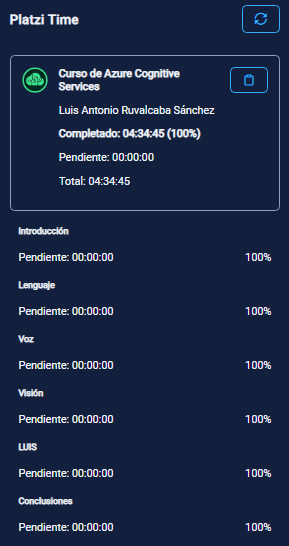

  <h1>Platzi Time extension</h1>
  

Platzi time is a simple extension to check the progress and time remaining to finish a Platzi course. To use it, you need to have a [Platzi course page](https://platzi.com/cursos/programacion-basica/) open, and the extension will show the following:

- The course title and badge
- The teacher's name
- The time spent on the course
- The progress of the course (in %)
- The time remaining to finish the course
- The total time of the course
- A list of modules with the progress (in %) and the time remaining to finish each one

> Note: The extension will only work if the course page is open and active. Sometimes, the extension doesn't show the course information if the page is not fully loaded. If this happens, use the reload button.
> 
> (I'm working on a fix for this 💀)

## Development

- Chrome:
  - Go to `chrome://extensions/`
  - Check the "Development" flag
  - Click on "Load unpacked" and point to the main folder of the project
  - Refresh the extension and the course page after making changes to the code
- Firefox:
  - Go to `about:debugging#addons`
  - Check "Enable add-on debugging"
  - Click on "Load Temporary Add-on" and point to `manifest.json`
  - Refresh the extension and the course page after making changes to the code
- Edge:
  - Go to `edge://extensions/`
  - Check "Developer mode"
  - Click on "Load unpacked" and point to the main folder of the project
  - Refresh the extension and the course page after making changes to the code

## License

[MIT License](LICENSE) file for more information.